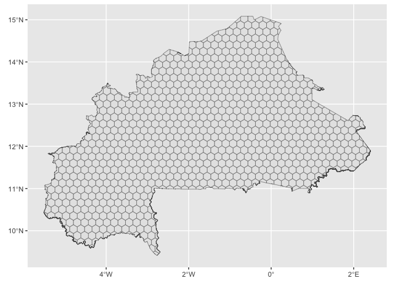

<!-- README.md is generated from README.Rmd. Please edit that file -->

# hexbur

<!-- badges: start -->
<!-- badges: end -->

The goal of hexbur is to provides several layers of information for
Burkina Faso, useful for agricultural systems analysis and more.

## Installation

You can install the development version of hexbur from
[GitHub](https://github.com/) with:

``` r
# install.packages("devtools")
devtools::install_github("oousmane/hexbur")
```

## Example

The package is based on a hexagonal grid of Burkina Faso, to which data
layers can be added. This grid may be loaded as follows, using the
`hex_map()` function

``` r
library(hexbur)
hex <- hex_map() # with no args.
```

A very quick viz of hex grids can be performed using `{sf}` and for sure
the `{tidyverse}`

``` r
library(hexbur)
library(sf)
library(tidyverse)

hex <- hex_map() # with no args.

# Simple hex grid map 
ggplot()+
  geom_sf(data = hex)
```



You’ll still need to render `README.Rmd` regularly, to keep `README.md`
up-to-date. `devtools::build_readme()` is handy for this.

You can also embed plots, for example:


In that case, don’t forget to commit and push the resulting figure
files, so they display on GitHub and CRAN.
