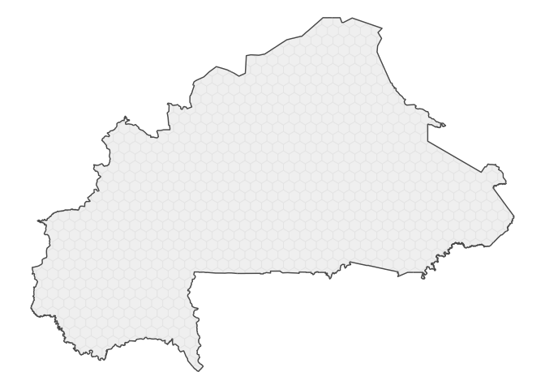
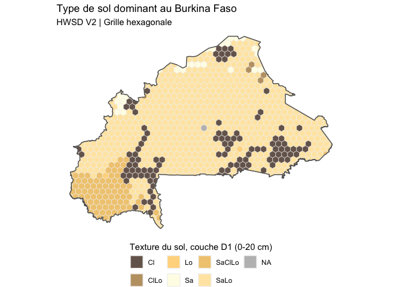

<!-- README.md is generated from README.Rmd. Please edit that file -->

# hexbur

<!-- badges: start -->
<!-- badges: end -->

The goal of hexbur is to provides several layers of information for
Burkina Faso, useful for agricultural systems analysis and more.

`hexbur`is a lighweight package that provide hexagonal grid of about 340
km^2. The original idea of this work belongs to
[@BjnNowak](https://github.com/BjnNowak).Benjamin, Thanks for building
[`frex`](https://github.com/BjnNowak/frex).

## Installation

You can install the development version of hexbur from
[GitHub](https://github.com/) with:

``` r
# install.packages("devtools")
devtools::install_github("oousmane/hexbur")
```

## Basic hex grids plot

The package is based on a hexagonal grid of Burkina Faso, to which data
layers can be added. This grid may be loaded as follows, using the
`hex_map()` function

``` r
library(hexbur)
hex <- hex_map() # with no args.
hex
#> Simple feature collection with 906 features and 1 field
#> Geometry type: MULTIPOLYGON
#> Dimension:     XY
#> Bounding box:  xmin: -5.511255 ymin: 9.415337 xmax: 2.407427 ymax: 15.08311
#> Geodetic CRS:  WGS 84
#> # A tibble: 906 × 2
#>    hex_id                                                                   geom
#>     <int>                                                     <MULTIPOLYGON [°]>
#>  1      1 (((-5.421255 10.32259, -5.421255 10.40261, -5.50264 10.4496, -5.50263…
#>  2      2 (((-5.464444 10.58552, -5.421255 10.61045, -5.421255 10.71438, -5.459…
#>  3      3 (((-5.44708 10.90732, -5.421255 10.92222, -5.421255 11.02614, -5.4881…
#>  4      4 (((-5.50264 10.4496, -5.421255 10.40261, -5.331255 10.45457, -5.33125…
#>  5      5 (((-5.459337 10.73637, -5.421255 10.71438, -5.331255 10.76634, -5.331…
#>  6      6 (((-5.488173 11.06478, -5.421255 11.02614, -5.331255 11.07811, -5.331…
#>  7      7 (((-5.331255 11.80052, -5.331255 11.80557, -5.352185 11.81766, -5.354…
#>  8      8 (((-5.241255 10.31451, -5.241255 10.40261, -5.331255 10.45457, -5.421…
#>  9      9 (((-5.241255 10.61045, -5.241255 10.71438, -5.331255 10.76634, -5.421…
#> 10     10 (((-5.241255 10.92222, -5.241255 11.02614, -5.331255 11.07811, -5.421…
#> # ℹ 896 more rows
```

`hex_map()` returns an `sf` object(spatial).

A very quick viz of hex grids can be performed using `{sf}` and for sure
the `{tidyverse}`,

``` r
library(sf)
library(tidyverse)

# Simple hex grid map 
ggplot()+
  geom_sf(data = hex)
```


This a beautiful plot of hex grids. R can handle spatial data and
produce beautiful maps. We can add, the border of country and make
things prettier. `admin0_map()`,`admin1_map()`, `admin2_map()`and
`admin3_map()` function allow you to download administrative boundary of
Burkina Faso. These boundaries is distributed par [Humanitarian Data
Exchange (HDX)](https://data.humdata.org). Below a better map of Burkina
hex grid.

``` r
admin0 <- admin0_map()

ggplot()+
  geom_sf(data = hex, color = "grey90",fill="grey95")+
  geom_sf(data = admin0,fill = NA,lwd=.5)+
  theme_void()
```



## Add static layer

`hexbur` provides access to static and dynamic layer data. For now, only
soil texture is supported (static layer). We will add further data
layers as soon as possible.

The soil information (texture) comes from FAO HWSDv2, but we mad
frequential analysis to determine dominant soil for each hex grid for 6
depths noted D1 to D6. Here is how to download soil information.

``` r
# Get soil usda texture data

hwsd <- get_static_layer(layer="soil")

hwsd_sf <- left_join(hex,hwsd)

hwsd_sf <- hwsd_sf %>% 
  mutate(
    across(
      .cols = starts_with("D"),
      .fns = num_to_usda # convert num to usda abreviation
    )
  ) %>% 
  relocate(geom, .after = everything())
str(hwsd_sf)
#> sf [906 × 8] (S3: sf/tbl_df/tbl/data.frame)
#>  $ hex_id: num [1:906] 1 2 3 4 5 6 7 8 9 10 ...
#>  $ D1    : chr [1:906] "SaClLo" "SaClLo" "SaClLo" "SaClLo" ...
#>  $ D2    : chr [1:906] "SaLo" "SaLo" "Cl" "SaLo" ...
#>  $ D3    : chr [1:906] "SaLo" "SaLo" "Cl" "SaLo" ...
#>  $ D4    : chr [1:906] "SaLo" "SaLo" "Cl" "SaLo" ...
#>  $ D5    : chr [1:906] "SaLo" "SaLo" "Cl" "SaLo" ...
#>  $ D6    : chr [1:906] "SaLo" "SaLo" "Cl" "SaLo" ...
#>  $ geom  :sfc_MULTIPOLYGON of length 906; first list element: List of 1
#>   ..$ :List of 1
#>   .. ..$ : num [1:356, 1:2] -5.42 -5.42 -5.5 -5.5 -5.5 ...
#>   ..- attr(*, "class")= chr [1:3] "XY" "MULTIPOLYGON" "sfg"
#>  - attr(*, "sf_column")= chr "geom"
#>  - attr(*, "agr")= Factor w/ 3 levels "constant","aggregate",..: NA NA NA NA NA NA NA
#>   ..- attr(*, "names")= chr [1:7] "hex_id" "D1" "D2" "D3" ...
```

With this dataset, we can visualize the distribution of soil texture for
the first depth D1 (0-20 cm). Here how:

``` r
ggplot()+
  geom_sf(data = hwsd_sf,aes(fill=D1),color="grey95")+
  scale_fill_manual(
    values = hwsd_cols(),# function to provide convenient colors for soil
    na.value = "grey"
  )+
  geom_sf(data = admin0,fill = NA,lwd=.5)+
  guides(
    fill = guide_legend(
      position = "bottom",
      title = "Texture du sol, couche D1 (0-20 cm)",
    )
  )+
  labs(
    title = "Type de sol dominant au Burkina Faso",
    subtitle = "HWSD V2 | Grille hexagonale"
  )+
  theme_void(
  )+
  theme(
    legend.title.position = "top"
  )
```


